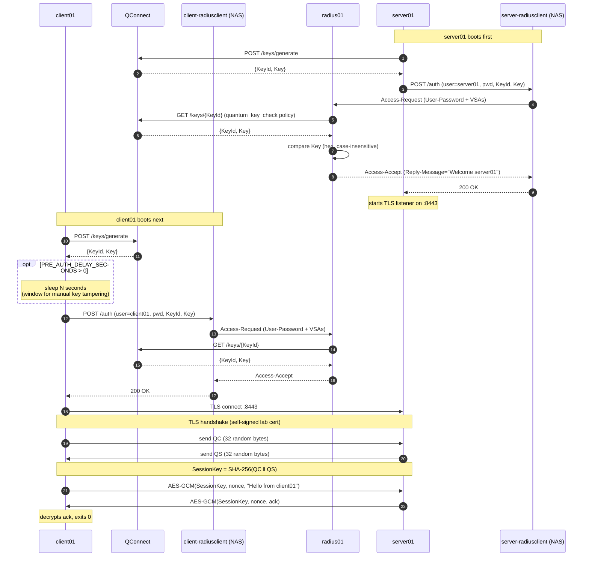
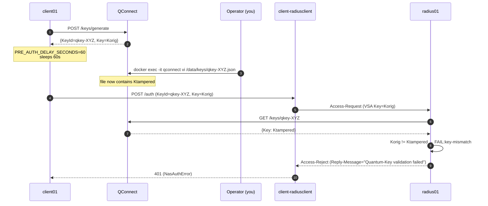

# Quantum Secure Lab — Architecture

> A small multi-container POC that combines classical AAA (RADIUS) with a
> quantum-derived application session key, demonstrating defence-in-depth
> for a client ⇄ server channel.

---

## 1. Bird's-eye view

```text
                        ┌────────────────┐
                        │   QConnect     │  RNG / key-distribution service
                        │  (FastAPI)     │  POST /keys/generate
                        │  qconnect:9000 │  GET  /keys/{KeyId}
                        └──────┬─────────┘
                               │ HTTP (KeyId, Key)
       ┌───────────────────────┼─────────────────────────┐
       │                       │                         │
       │ (1) register          │ (1) register            │ (5) authoritative
       │     get KeyId/Key     │     get KeyId/Key       │     key lookup at
       │                       │                         │     auth-time
       ▼                       ▼                         │
┌─────────────┐         ┌─────────────┐                  │
│   client01  │         │   server01  │                  │
│  (Python)   │         │  (Python)   │                  │
└──────┬──────┘         └──────┬──────┘                  │
       │ (2) HTTPS-ish /auth   │ (2) HTTP /auth          │
       │     KeyId,Key,        │     KeyId,Key,          │
       │     user,pass         │     user,pass           │
       ▼                       ▼                         │
┌────────────────────┐   ┌────────────────────┐          │
│ client-radiusclient│   │ server-radiusclient│          │
│  NAS (FastAPI +    │   │  NAS (FastAPI +    │          │
│  pyrad)            │   │  pyrad)            │          │
└──────────┬─────────┘   └──────────┬─────────┘          │
           │                        │                    │
           │ (3) RADIUS Access-     │ (3) Access-Request │
           │     Request UDP/1812   │                    │
           ▼                        ▼                    │
        ┌─────────────────────────────────┐              │
        │             radius01            │ (4) policy   │
        │  (FreeRADIUS 3.2.5 + custom     │     quantum_ │
        │   policy.d/quantum-key-check)   │     key_check│
        └────────┬────────────────────────┘──────────────┘
                 │ (6) Access-Accept / Access-Reject
                 ▼
        back through NAS → supplicant

        ┌─────────────────────┐
        │ client01 ──TLS──── server01 :8443                              │
        │  (7) exchange QC ⇄ QS  (random 32-byte halves)                 │
        │  (8) SessionKey = SHA-256(QC ‖ QS)                             │
        │  (9) AES-GCM business messages inside the TLS tunnel           │
        └────────────────────────────────────────────────────────────────┘

        ┌────────────┐        ┌────────────┐
        │ radius-ui  │ direct │  radius01  │  smoke-test UI on :8081
        │ :8081      │───────►│            │  (bypasses NAS on purpose)
        └────────────┘        └────────────┘
```

All containers attach to one external Docker bridge network: **`quantum-net`**.

---

## 2. Service inventory

| Service | Image | Ports | Role |
|---|---|---|---|
| **qconnect** | `quantum-lab/qconnect:latest` (Python 3.12 + FastAPI) | `9000/tcp` | RNG / key-distribution. One JSON file per `(KeyId, Key)` under `/data/keys` (Docker volume `qconnect-data`). |
| **radius01** | `quantum-lab/radius01:latest` (FreeRADIUS 3.2.5 + custom raddb) | `1812/udp`, `1813/udp` | AAA. Validates username/password **and** `(Quantum-Key-Id, Quantum-Key)` VSAs by querying QConnect at auth time. |
| **client-radiusclient** | `quantum-lab/client-radiusclient:latest` (Python + pyrad) | `8082/tcp` (internal only) | NAS dedicated to `client01`. HTTP `/auth` → RADIUS Access-Request. |
| **server-radiusclient** | `quantum-lab/server-radiusclient:latest` (same image base) | `8082/tcp` (internal only) | NAS dedicated to `server01`. |
| **server01** | `quantum-lab/server01:latest` (Python + cryptography) | `8443/tcp` | TLS application server. On boot: register with QConnect, auth via NAS, then `serve_forever` quantum/AES-GCM protocol. |
| **client01** | `quantum-lab/client01:latest` (Python + cryptography) | — | One-shot supplicant. Register, (optional pause for failure tests), auth via NAS, connect to `server01`, exchange `QC`/`QS`, send AES-GCM message. |
| **radius-ui** | `quantum-lab/radius-ui:latest` (FastAPI + Jinja) | `8081/tcp` | Browser-based RADIUS sanity tool. Speaks RADIUS **directly** to `radius01` (intentionally bypasses the NAS / VSA policy). |

---

## 3. End-to-end success flow (sequence)



---

## 4. Failure-test flow (key tampering)

Used to verify that RADIUS truly consults QConnect live and never trusts the
supplicant-supplied `Quantum-Key`.



---

## 5. Repository layout

```text
QUANTUM/
├── docker-compose.yml                 # top-level orchestration (extends per-folder composes)
├── Architecture.md                    # this file
├── QConnect/                          # RNG service
│   ├── Dockerfile                     # python:3.12-slim + vim-tiny
│   ├── docker-compose.yml
│   └── app/main.py                    # FastAPI routes /keys/*
├── RADIUS/                            # FreeRADIUS server
│   ├── Dockerfile                     # FR 3.2.5 + custom raddb + helper script
│   ├── docker-compose.yml             # exports QCONNECT_URL to FR's exec env
│   ├── raddb/
│   │   ├── clients.conf               # NAS allow-list, shared secret
│   │   ├── dictionary.quantum-lab     # vendor 99999 VSAs
│   │   ├── mods-config/files/authorize  # user accounts
│   │   └── policy.d/quantum-key-check # quantum_key_check policy (unlang)
│   └── scripts/
│       ├── qconnect-fetch.sh          # convenience: seed keys file
│       └── quantum-key-check.sh       # helper invoked by %{exec:...}
├── RADIUS_CLIENT/                     # the NAS image (one image, two services)
│   ├── Dockerfile                     # python:3.12-slim + pyrad
│   ├── docker-compose.yml             # client-radiusclient, server-radiusclient
│   └── app/
│       ├── main.py                    # FastAPI /auth, /healthz; pyrad client
│       └── radius_dictionary          # standalone dict for pyrad
├── RADIUS_UI/                         # browser smoke tool (direct to RADIUS)
│   ├── Dockerfile / docker-compose.yml
│   └── app/{main.py, templates/index.html, radius_dictionary}
├── SERVER/                            # server01 supplicant
│   ├── Dockerfile / docker-compose.yml
│   └── app/{main.py, tls_server.py, quantum.py, crypto_session.py,
│            qconnect_client.py, nas_auth.py, framing.py, config.py}
└── CLIENT/                            # client01 supplicant
    ├── Dockerfile / docker-compose.yml
    └── app/{main.py, tls_client.py, quantum.py, crypto_session.py,
             qconnect_client.py, nas_auth.py, framing.py, config.py}
```

---

## 6. Authentication layer details

### 6.1 RADIUS dictionary (vendor 99999, "Quantum-Lab")

```text
ATTRIBUTE  Quantum-Key-Id  1  string
ATTRIBUTE  Quantum-Key     2  string
```

Loaded by FreeRADIUS via `$INCLUDE dictionary.quantum-lab` (appended at image
build time) and by pyrad via `RADIUS_CLIENT/app/radius_dictionary`. The NAS
puts these into Vendor-Specific (attr 26) inside every Access-Request.

### 6.2 `quantum_key_check` policy (`RADIUS/raddb/policy.d/quantum-key-check`)

```unlang
quantum_key_check {
    if (&User-Name == "client01" || &User-Name == "server01") {
        if (!&Quantum-Key-Id || !&Quantum-Key) {
            update reply { Reply-Message := "Quantum-Key VSAs missing" }
            reject
        }
        else {
            if ("%{exec:/usr/local/bin/quantum-key-check %{Quantum-Key-Id} %{Quantum-Key}}" != "OK") {
                update reply { Reply-Message := "Quantum-Key validation failed" }
                reject
            }
        }
    }
}
```

- Enforced **only** for `client01` / `server01` so `testuser`, `radtest`, and
  `radius-ui` continue to work without VSAs.
- Injected at the top of `authorize {}` in `sites-enabled/default` via a `sed`
  step in `RADIUS/Dockerfile` (idempotent).
- Requires the default `exec` module to have `wait = yes` (also fixed by
  `sed` in the Dockerfile) so `%{exec:...}` can capture stdout.

### 6.3 Helper script (`/usr/local/bin/quantum-key-check`)

```text
INPUT   KeyId='qkey-…'  SuppliedKey='…'  (len=64)
TARGET  http://qconnect:9000/keys/qkey-…
HTTP    status=200
BODY    {"KeyId":"qkey-…","Key":"…"}
STORED  Key='…'
COMPARE supplied(lc)=…
        stored  (lc)=…
RESULT  OK | FAIL:<reason>
```

- Always exits 0; the result token is on **stdout** (`OK` / `FAIL:…`).
- Verbose trace goes to **stderr** and to `/tmp/quantum-key-check.log`.
- No caching — every Access-Request triggers a fresh `GET /keys/{KeyId}`.
- Fail-closed: any HTTP error, missing field, or mismatch → `FAIL:…` →
  Access-Reject.

### 6.4 Why two NAS containers?

`client-radiusclient` and `server-radiusclient` are two **separate**
containers built from the same image, distinguished by:

- `container_name` and `hostname` (so each supplicant has its own DNS target)
- `NAS_IDENTIFIER` env (`client-radiusclient-01`, `server-radiusclient-01`)
  so FreeRADIUS logs can tell them apart.

`clients.conf` uses a single catch-all `0.0.0.0/0` entry on `quantum-net`
with `require_message_authenticator = no` (pyrad does not send it). Real
deployments would pin to each NAS's static IP.

---

## 7. Application session details (CLIENT ⇄ SERVER)

After RADIUS auth succeeds:

1. **TLS** (self-signed cert generated on first `server01` boot, stored in
   `server01-certs` volume; client trusts it via `CERT_DIR` mount).
2. **Quantum exchange** (`tls_client.exchange_quantum` / `tls_server`):
   each side sends 32 random bytes via the length-prefixed framing in
   `framing.py`.
   - `QC` = client contribution, `QS` = server contribution.
   - Currently both are `os.urandom(32)` placeholders (`quantum.py`), to be
     replaced by a real QRNG hook in production.
3. **Session key**: `SessionKey = SHA-256(QC ‖ QS)` (`crypto_session.derive_session_key`).
4. **Business traffic**: `AES-GCM(SessionKey, 12-byte nonce, plaintext)`
   inside the TLS tunnel (`crypto_session.encrypt/decrypt`).

This is **defence-in-depth**: even if TLS were compromised, the
quantum-derived session key would still protect the business payload (and
vice versa).

---

## 8. Configuration knobs (env vars)

### Per-component

| Container | Var | Default | Purpose |
|---|---|---|---|
| qconnect | `QCONNECT_DATA_DIR` | `/data/keys` | Where key JSON files live (volume-backed). |
| qconnect | `KEY_BYTES` | `32` | Raw key length before hex encoding. |
| qconnect | `LOG_LEVEL` | `INFO` | |
| radius01 | `QCONNECT_URL` | `http://qconnect:9000` | Inherited by `radiusd`'s `rlm_exec` children → used by the helper script. |
| *-radiusclient | `RADIUS_HOST` / `RADIUS_AUTH_PORT` | `radius01` / `1812` | UDP target. |
| *-radiusclient | `RADIUS_SECRET` | `testing123` | RFC 2865 shared secret. |
| *-radiusclient | `NAS_IDENTIFIER` | per service | Logged by FreeRADIUS to distinguish NASes. |
| *-radiusclient | `NAS_SHARED_TOKEN` | `lab-nas-token` | Bearer token between supplicant and NAS. |
| client01 / server01 | `USERNAME` / `PASSWORD` | identity-matching | Validated by FreeRADIUS `authorize`. |
| client01 / server01 | `NAS_URL` | `http://<their-nas>:8082` | HTTP endpoint of their dedicated NAS. |
| client01 / server01 | `QCONNECT_URL` | `http://qconnect:9000` | For initial key registration. |
| client01 / server01 | `NAS_HTTP_TIMEOUT` | `120` | HTTP timeout to NAS. Must exceed any client-side `PRE_AUTH_DELAY_SECONDS`. |
| **client01** | `PRE_AUTH_DELAY_SECONDS` | `60` | Pause between QConnect registration and NAS auth, for manual failure tests. Set to `0` for production-like timing. |
| server01 | `LISTEN_HOST` / `LISTEN_PORT` | `0.0.0.0` / `8443` | TLS listener. |
| server01 | `CERT_DIR` / `CERT_CN` | `/app/certs` / `server01` | Self-signed cert generation. |
| client01 | `SERVER_HOST` / `SERVER_PORT` | `server01` / `8443` | TLS target. |
| radius-ui | `RADIUS_HOST` / `RADIUS_AUTH_PORT` / `RADIUS_SECRET` | `radius01` / `1812` / `testing123` | Direct RADIUS speak. |

### Lab accounts (in `RADIUS/raddb/mods-config/files/authorize`)

| Username | Password | Notes |
|---|---|---|
| `client01` | `clientPassword` | App client identity; enforced by `quantum_key_check`. |
| `server01` | `serverPassword` | App server identity; enforced by `quantum_key_check`. |
| `testuser` | `testpw`          | For `radtest` / `radius-ui`; bypasses `quantum_key_check`. |

---

## 9. Boot order

Documented order (also what the top-level compose dependency graph
produces):

```text
RADIUS_CLIENT (client-radiusclient, server-radiusclient)   ← healthchecked
    │
    ├── RADIUS (radius01)
    │
    ├── QConnect (qconnect)
    │       │
    │       ├── SERVER (server01)   [depends_on: qconnect, server-radiusclient healthy]
    │       │       └── CLIENT (client01)   [depends_on: qconnect, client-radiusclient healthy, server01 healthy]
    │       │
    │       └── RADIUS_UI (radius-ui)   [depends_on: radius01]
```

Notes:

- `radius01` does **not** wait on `qconnect`: only the
  `client01`/`server01` auth flows hit the helper script, and those happen
  *after* the supplicant has already registered with QConnect, so it's
  guaranteed to be up by then.
- The NAS containers don't `depends_on: radius01` either — they contact
  RADIUS lazily on `/auth`, and their healthcheck is purely HTTP `/healthz`.

---

## 10. Running the lab

```powershell
# Prereq (once):
docker network create quantum-net

# From the workspace root:
docker compose up --build

# Watch the interesting bits:
docker logs -f radius01
docker logs -f client01
docker exec radius01 tail -f /tmp/quantum-key-check.log
```

### Quick happy-path smoke (via the NAS, no full stack run)

```powershell
$resp = curl -s -X POST http://localhost:9000/keys/generate | ConvertFrom-Json
curl -s -X POST http://localhost:8082/auth `
  -H "Authorization: Bearer lab-nas-token" `
  -H "Content-Type: application/json" `
  -d "{`"username`":`"client01`",`"password`":`"clientPassword`",`"KeyId`":`"$($resp.KeyId)`",`"Key`":`"$($resp.Key)`"}"
# -> {"ok":true,"reply_message":"Welcome client01","reason":""}
```

### Manual failure test (the key-tampering scenario)

```powershell
# 1. Bring up everything except client01.
docker compose up -d --build qconnect radius01 client-radiusclient server-radiusclient server01

# 2. Run client01 in the foreground.
docker compose up --build client01

# 3. While client01 logs "PRE_AUTH_DELAY_SECONDS=60.0 - sleeping ...",
#    tamper with the key inside QConnect:
docker exec -it qconnect vi /data/keys/qkey-XXXXXXXXXXXX.json
# change "Key", :wq

# 4. Expected outcome on the NAS:
docker logs client-radiusclient | Select-String "Forwarding|Access-(Accept|Reject)"
#   Access-Reject for user=client01 reply_message='Quantum-Key validation failed'

# 5. Full debug trail:
docker exec radius01 tail -n 40 /tmp/quantum-key-check.log
```

---

## 11. Security stance (POC vs production)

| Concern | POC today | Production direction |
|---|---|---|
| QRNG | `os.urandom(32)` placeholder (`quantum.py`) | Hardware / vendor QRNG service hook. |
| QConnect auth | none | Bearer token in front of every endpoint (mirrors NAS). |
| RADIUS clients.conf | catch-all `0.0.0.0/0` on quantum-net | Per-NAS static IP pinning. |
| Vendor ID | `99999` (lab) | Real IANA-assigned PEN. |
| TLS cert | self-signed, generated in container | Real PKI / mTLS. |
| `Message-Authenticator` | disabled (`require_message_authenticator = no`) so pyrad packets are accepted by FR 3.2.5 (BlastRADIUS mitigation) | Enable, use pyrad ≥ version that injects it. |
| Helper script logs full keys | yes (lab convenience) | Redact or hash; truncate to prefix. |

---

## 12. Glossary

- **NAS** — Network Access Server. In RADIUS terms, the device that
  collects the user credentials from the supplicant and forwards them to
  the RADIUS server. Here, the two FastAPI containers act as NASes.
- **VSA** — Vendor-Specific Attribute. RADIUS attribute 26 carrying
  vendor-defined sub-attributes; we use it to transport
  `Quantum-Key-Id` / `Quantum-Key`.
- **QConnect** — the lab's stand-in for a real RNG / key-distribution
  product. Generates and serves `(KeyId, Key)` pairs.
- **QC / QS** — the client's and server's 32-byte quantum-random
  contributions to the session key (`SessionKey = SHA-256(QC ‖ QS)`).
- **Supplicant** — the entity being authenticated (`client01`, `server01`).

